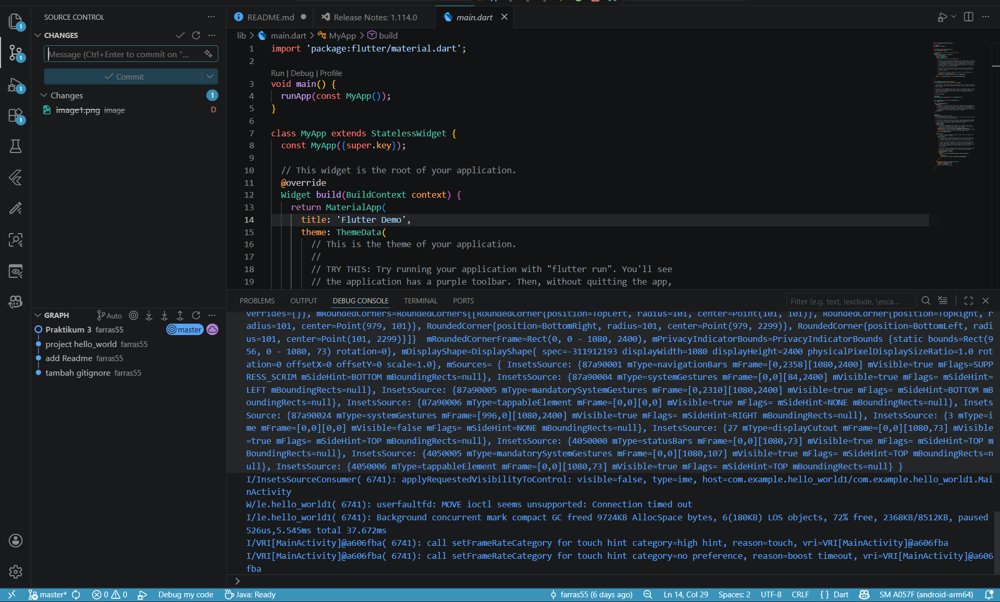
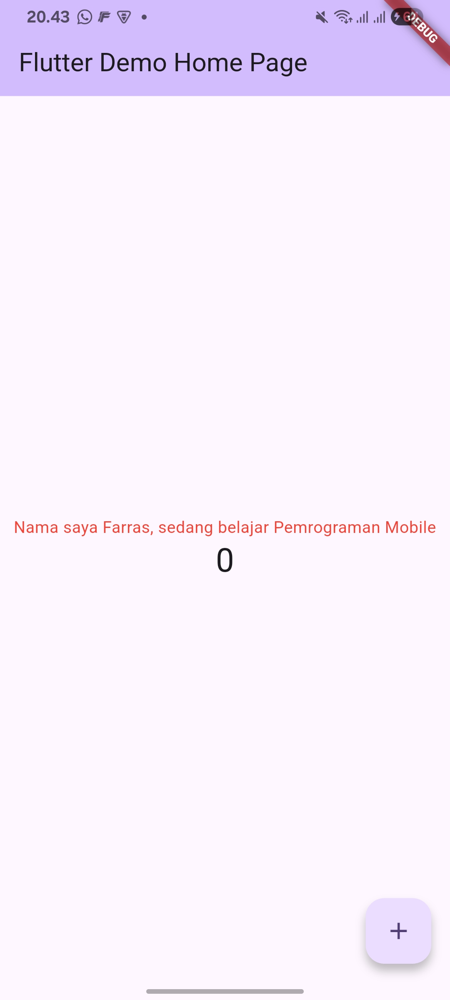
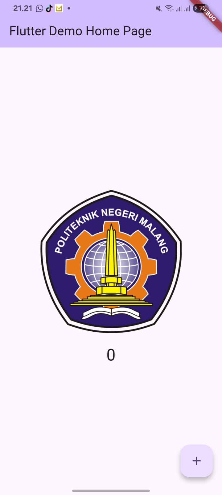

# hello_world1

A new Flutter project.

## Praktikum 3 : Membuat Repository GitHub dan Laporan Praktikum

## Praktikum 4: Menerapkan Widget Dasar

**Langkah 1 : Text Widget**

**Langkah 2: Image Widget**

